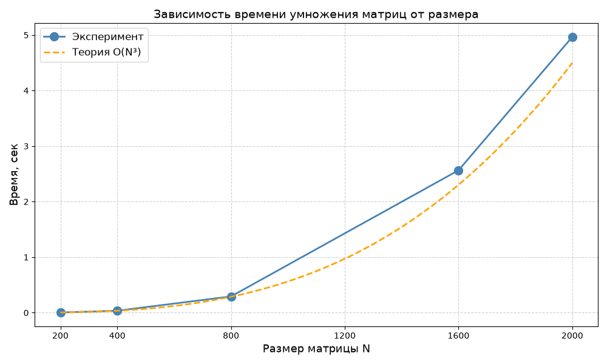

# Лабораторная работа №1
## 1. Задание
Написать программу на языке C/C++ для перемножения двух квадратных матриц, в качестве исходных данных использовать файл(ы), содержащие значения исходных матриц. Выходные данные должны включать файл со значениями результирующей матрицы, время выполнения, объем задачи и др. Обязательна автоматизированная верификация результатов вычислений с помощью сторонних библиотек или стороннего ПО (например на Matlab/Python).
## 2. Структура
- `generate.py` - Программа на Python, создающая два txt файла квадратных матриц по заданному размеру со случайными числами в диапазоне (0-9) и размером на первой строке
- `multmatrix.cpp` - Программа на C++, читающая два txt файла квадратных матриц, умножающая их элементы по циклам `i-k-j`, записывающая результат в новый txt файл и выводящая размер матриц и время умножения матриц
- `verify.py` - Программа на Python, читающая исходные txt файлы квадратных матриц, умножающая их с помощью библиотеки NumPy и сравнивающая получившийся результат с результатом программы на C++, выводя результат сравнения
- `matrix_a.txt` - Файл, создаваемый программой `generate.py`, включающий размер квадратной матрицы на первой строке и случайные числа в диапазоне (0-9) на остальных строках
- `matrix_b.txt` - Файл, создаваемый программой `generate.py`, включающий размер квадратной матрицы на первой строке и случайные числа в диапазоне (0-9) на остальных строках
- `matrix_c.txt` - Файл, создаваемый программой `multmatrix.cpp`, включающий размер квадратной матрицы на первой строке и результаты умножения исходных матриц на остальных строках
## 3. Реализация
### 3.1 `multmatrix.cpp`
- Функция `readMatrix` для чтения матриц из `txt` файлов, содержащих размер матриц в первой строке
- Проверка корректности файлов и размеров матриц, вывод ошибки в случае обнаружения несоответствия
- Цикл, запускающий умножение 5 раз для увеличенной выборки данных о времени выполнения операции
- Умножение матриц реализовано тройным вложенным циклом: внешний по строкам, средний по общему индексу, внутренний по столбцам. Тело цикла выполняется `N * N * N = N^3` раз, по одному умножению и сложению на каждой итерации. Временная сложность алгоритма - `O(N^3)`.
- Порядок циклов `i-k-j` читает матрицу B построчно и эффективнее использует кэш процессора
- `high_resolution_clock` для измерения времени умножения матриц, не считает время их считывания и создание файла результата
- Вывод результатов в формате `Size: NxN | Time: N sec`
### 3.2 `generate.py`
- Используется библиотека `NumPy`
- Функция `numpy.random.randint` создаёт массив заданного пользователем размера, заполняя его случайными целыми числами в диапазоне (0-9)
- Функция `numpy.savetxt` сохраняет массив в файл, записывая размер матрицы в первую строку с помощью параметра `header = str(n)`
### 3.3 `verify.py`
- Используется библиотека `NumPy`
- Функция `numpy.loadtxt` читает матрицы из файлов, с помощью параметра `skiprows = 1` пропуская первую строку с размером, а параметр `dtype = numpy.int64` указывает на целочисленный тип элементов
- Оператор матричного умножения `@` вызывает `numpy.matmul` и выполняет умножение матриц, является эталоном, его результат подходит для верификации
- Функция `numpy.array_equal` поэлементно сравнивает массивы, используется так как обе матрицы целочисленные, и совпадение должно быть точным
## 4. Результаты замеров
| Размеры матриц | Время (сек) |
|:--------------:|:-----------:|
| 200 × 200      | 0.0045      |
| 400 × 400      | 0.036       |
| 800 × 800      | 0.2937      |
| 1600 × 1600    | 2.5644      |
| 2000 × 2000    | 4.9657      |

Замеры проводились в конфигурации `Release`, были выбраны наилучшие результаты среди пяти в цикле.
## 5. Расчёты
При удвоении размера матрицы время работы алгоритма O(N^3) должно увеличиваться в 8 раз (2^3 = 8). При переходе от 1600 к 2000 - в 1.95 раз (1.25^3 = 1.95)
| Переход | Рост N | Ожидаемый рост (O(N^3)) | Фактический рост | Отклонение |
|:-------:|:------:|:----------------------:|:----------------:|:----------:|
| 200 → 400   | ×2   | ×8   | 0.0360 / 0.0045 = 8.00 | 0%   |
| 400 → 800   | ×2   | ×8   | 0.2937 / 0.0360 = 8.16 | +2%  |
| 800 → 1600  | ×2   | ×8   | 2.5644 / 0.2937 = 8.73 | +9%  |
| 1600 → 2000 | ×1.25 | ×1.95 | 4.9657 / 2.5644 = 1.94 | –1%  |

Рост времени во всех переходах близок к теоретическому.
## 6. График

## 7. Выводы
1. Время работы алгоритма растёт пропорционально N^3, что подтверждает теоретическую оценку сложности O(N^3)
2. Отношения времён при удвоении N составили 8.00, 8.16, 8.73 - близко к теоретическому значению 8
3. Превышение на больших N объясняется эффектами кэш-памяти и ростом накладных расходов, но не меняет алгоритмическую сложность.
